# Arduino Lab - E-Commerce Project

## Welcome to Arduino Lab

Arduino Lab is an online shop concept dedicated to Arduino enthusiasts, hobbyists, and makers looking for a variety of Arduino-compatible microcontrollers and accessories. This project demonstrates a fully functional e-commerce platform built with Django, featuring product listings, cart functionality, user accounts, and secure checkout with simulated payment processing.

This project is the final portfolio submission for the Code Institute Diploma in Fullstack Software Development and serves as a demonstration of full-stack development skills in e-commerce application design.

> **Disclaimer**: This project is intended exclusively for educational purposes and should not be used for real commercial transactions or any unauthorized business purposes or other uses. The author assumes no responsibility for misuse or adaptation for commercial objectives.

You can explore the live project here: [Arduino Lab](https://arduino-lab-project-ab20ce1e1a15.herokuapp.com/)

## Table of Contents

- [Project Overview](#project-overview)
  - [Agile Workflow](#agile-workflow)
- [User Experience](#user-experience)

  - [Strategy](#strategy)
    - [Primary Goals](#primary-goals)
    - [Business Model](#business-model)
    - [Marketing](#marketing)
    - [Search Engine Optimisation](#search-engine-optimisation)
  - [Structure](#structure)
    - [Pages](#pages)
    - [Pages provided by Django](#pages-provided-by-django)
    - [Technical Design](#technical-design)
      - [Code Structure](#code-structure)
      - [Database](#database)
      - [Data Models](#data-models)
      - [Schema of models](#schema-of-models)
  - [Scope - Epics and User Stories](#scope-epics-and-user-stories)
  - [Project Setup](#project-setup)

    - [Epic 1: Django Project Initialization](#django-project-initialization)
    - [Epic 2:Install Required Packages](#install-required-packages)
    - [Epic 3:Setup Admin Panel for Store Management](#setup-admin-panel-for-store-management)
    - [Epic 4:User Authentication Setup](#user-authentication-setup)
    - [Epic 5:E-commerce App Creation](#e-commerce-app-creation)
    - [Epic 6:Database Configuration](#database-configuration)
    - [Epic 7:Static and Media Files Configuration](#static-and-media-files-configuration)

  - [Project Implementation](#project-implementation)

    - [Epic 1:Product Search and Browsing](#product-search-and-browsing)
    - [Epic 2:Detailed Product Information](#detailed-product-information)
    - [Epic 3:Shopping Cart](#shopping-cart)
    - [Epic 4:Account Creation](#account-creation)
    - [Epic 5:Secure Payment](#secure-payment)
    - [Epic 6:Order Confirmation](#order-confirmation)
    - [Epic 7:Product Filtering](#product-filtering)
    - [Epic 8:Product Reviews](#product-reviews)
    - [Epic 9:Create a Comprehensive README File](#create-a-comprehensive-readme-file)
    - [Epic 10:Deployment to Heroku](#deployment-to-heroku)

  - [Entity Relationship Diagram](<#Entity-Relationship-Diagram-(ERD)>)
    - [Colors](#colors)
    - [Design Choices](#design-choices)
    - [Typography](#typography)

- [Existing Features](#existing-features)
  - [Feature 1: The Navbar](#feature-1-the-navbar)
  - [Feature 2: The Home Page](#feature-2-the-home-page)
  - [Feature 3: The Footer](#feature-3-the-footer)
  - [Feature 4: The Products List](#feature-4-the-products-list)
  - [Feature 5: The Product Detail Page](#feature-5-the-product-detail-page)
  - [Feature 6: The Cart](#feature-6-the-cart)
  - [Feature 7: The Sign Up/In/Out Pages](#feature-7-the-sign-up-in-out-pages)
  - [Feature 8: The Product Management](#feature-8-the-product-management-page)
  - [Feature 9: Store settings](#feature-9-store-settings-page)
  - [Feature 10: Change Password](#feature-10-change-password)
  - [Feature 11: My Profile](#feature-11-my-profile)
- [Features Yet to Implement](#features-yet-to-implement)
- [Technologies Used](#technologies-used)
  - [Languages](#languages)
  - [Frameworks, Libraries and Other Resources](#frameworks-libraries-and-other-resources)
- [Testing](#testing)
- [Other Services](#other-services)
  - [Stripe](#stripe)
- [Deployment](#deployment)
  - [Forking the GitHub Repository](#forking-the-github-repository)
  - [Making a Local Clone](#making-a-local-clone)
  - [Heroku](#heroku)
  - [AWS S3](#aws-s3)
- [Credits](#credits)
  - [Copyrights](#copyrights)
    - [Media](#media)
    - [Content](#content)
  - [Coding Tips and Tricks](#coding-tips-and-tricks)
  - [Acknowledgments](#acknowledgments)

---

## Project Overview

**Arduino Lab** is an online store designed to meet the needs of hobbyists, students, and professionals working with Arduino and other electronics projects. The platform provides a wide range of microcontrollers like: Arduino , ESP32, RPi,STM32 and other, making it a one-stop shop for DIY electronics enthusiasts.

The project is built with the **Django** web framework, combining a robust backend with dynamic and user-friendly frontend features. This online shop is structured to be highly modular and scalable, supporting future enhancements like additional product categories, user accounts, and more extensive e-commerce functionalities.

### Key Features

- **Product Catalog**: A categorized, searchable list of products, each with detailed descriptions, specifications, and pricing.
- **User Registration and Account Management**: Users can register, log in, and manage their accounts, including viewing order history and updating profile information.
- **Shopping Cart and Checkout**: A secure, streamlined shopping experience with cart management and integrated payment options.
- **Admin Dashboard**: Site administrators can manage products, orders, and user accounts, with full access to the backend database via the Django admin interface and site interface.

### Technologies Used

- **Django**: As the primary web framework, Django enables rapid development, scalability, and maintainability.
- **Bootstrap 4**: For responsive and modern design, ensuring the shop is accessible and attractive on any device.
- **PostgreSQL**: A robust relational database for storing user, product, and order information.
- **Stripe API**: Integrated for secure payment processing, supporting a smooth checkout process.
- **AWS S3**: For storing and serving media files efficiently.

## Agile Workflow

For this project, an agile approach was used to manage tasks effectively and ensure a smooth development process. The workflow was structured using GitHub Projects to track and visualize progress. The following boards represent the project's tasks, organized in columns for **Todo**, **In Progress**, and **Done** stages.

### Project Setup Board

This board includes initial setup tasks required to build the foundation of the application. The completed tasks for project setup are:

- Django Project Initialization
- Install Required Packages
- Setup Admin Panel for Store Management
- User Authentication Setup
- E-commerce App Creation
- Database Configuration
- Static and Media Files Configuration

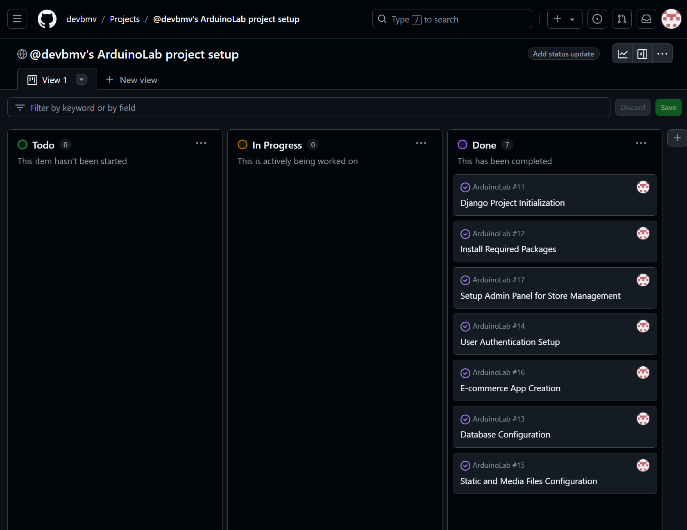

### Project Development Board

This board tracked the primary development tasks for the e-commerce functionalities of **Arduino Lab**. Key tasks included:

- Product Search and Browsing
- Detailed Product Information
- Shopping Cart
- Account Creation
- Secure Payment
- Order Confirmation
- Product Filtering
- Product Reviews
- Create a Comprehensive README File
- Deployment to Heroku

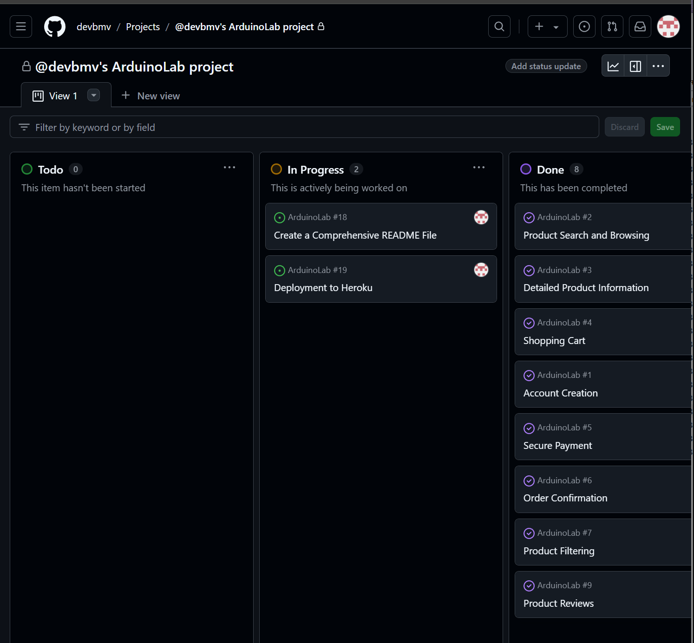

This agile structure facilitated organized development, enabled continuous monitoring of project progress, and provided visibility into tasks yet to be completed or those in the pipeline. This approach enabled incremental development, delivering features in manageable portions, and adjusting priorities as needed.

### User Experience

- **Arduino Lab**
  Welcome to Arduino Lab – Unleash Your Creativity with Our Latest Microcontroller Collection! Dive into the world of innovation and discover powerful microcontrollers designed for your next project.
  Arduino Lab aims to be a specialized online store dedicated to selling microcontrollers, specifically tailored for electronics enthusiasts and professional developers. The platform focuses exclusively on offering a wide range of microcontrollers, including popular models such as ESP, STM, AVR, and more.
- The primary goal is to provide users with a seamless shopping experience for microcontrollers, offering advanced search and filtering options based on specifications and categories, along with secure payment processing.

## Strategy

### Primary Goals

1. **Product Availability**: Offer a wide range of microcontrollers and related components, catering to both beginner and advanced makers.
2. **User Engagement**: Encourage customers to explore, learn, and experiment with various microcontroller platforms.
3. **Customer Satisfaction**: Provide a seamless shopping experience, quick support, and informative resources to assist users with their projects.
4. **Sales Growth**: Increase sales through effective marketing, special offers, and loyalty programs.

### Business Model

Arduino Lab is an e-commerce platform focused on selling microcontrollers, development boards, and accessories. The primary products include items from categories such as **AVR**, **ARM**, **ESP**, **Raspberry Pi**, **MSP430**, and **8051**. Key elements of the business model include:

- **Revenue Model**: Product sales with a focus on bundle offers, cross-selling, and upselling.
- **Free Delivery**: For orders over $50, incentivizing higher purchase values.
- **Educational Resources**: Provide learning materials and tutorials to support customers' projects and drive engagement.

### Marketing

1. **Target Audience**:
   - Electronics hobbyists, students, and professionals working on embedded systems and IoT projects.
2. **Content Marketing**:
   - Publish articles, project ideas, and tutorials to inspire customers and position Arduino Lab as a resourceful learning hub.
3. **Email Marketing**:
   - Use email campaigns to inform customers of new arrivals, special offers, and educational content.
     

### Search Engine Optimization

- **SEO Strategy**: To increase visibility, Arduino Lab will implement SEO practices, including keyword optimization for terms related to microcontrollers, technical specifications, and DIY electronics. The website will be structured with descriptive meta tags, optimized product descriptions, and relevant keywords to improve search rankings and reach a broader audience in the electronics and developer communities. The same I have generated a sitemap.xml and robots.txt file for my project.
  Arduino Lab is aimed at becoming a trusted source for Arduino and electronics supplies, combining a clean design with efficient backend operations to deliver an enjoyable shopping experience.

1. **Keyword Strategy**:
   - Use keywords relevant to microcontroller brands, electronics projects, tutorials, and related accessories.
2. **On-Page SEO**:
   - Optimize page titles, meta descriptions, and headings for better visibility in search engine results.
3. **Product Descriptions**:
   - Include detailed, keyword-rich descriptions of products to improve ranking and inform potential buyers.
     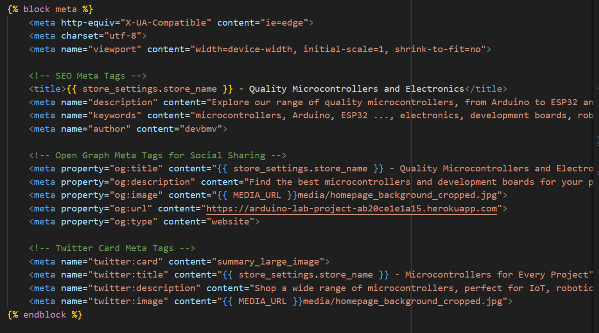
4. **Content SEO**:
   - Regularly publish informative articles, tutorials, and guides to drive organic traffic.
5. **Social Media Marketing**

   - **Facebook Page**: I have been created a facebook page(it is a fake facebook page and it is just for educational purpose ,because my online shop is not a real) to promote my online store ArduinoLab.
     
     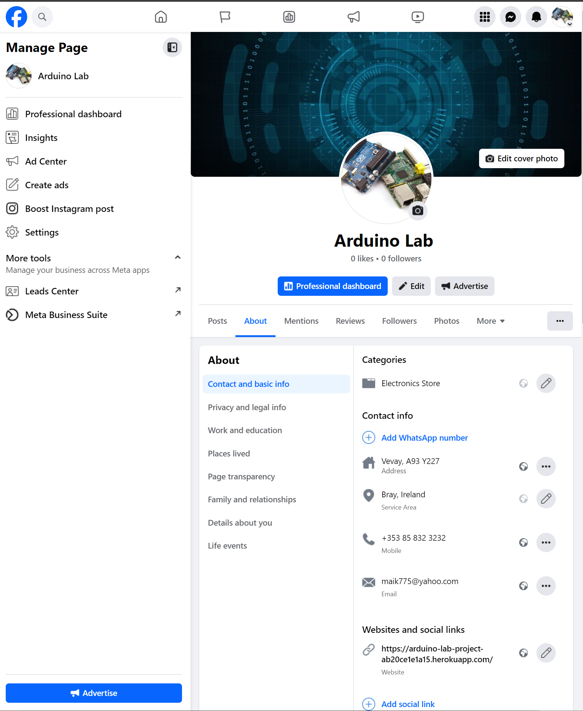

6. **Email Marketing**
   - Build a subscriber list by offering valuable content like project tutorials and special discounts.
   - Run regular email campaigns with promotions, new product launches, and exclusive offers to engage our customer base and encourage repeat purchases.
     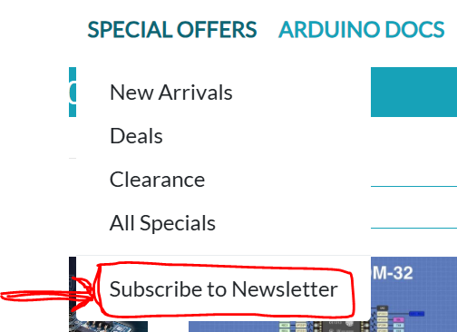
     
7. **Collaborations & Partnerships**
   - Partner with educational institutions, makerspaces, and electronics hobbyist communities to promote our products as tools for learning and innovation.
   - Collaborate with influencers in the electronics and maker communities to review our products and create project videos.
     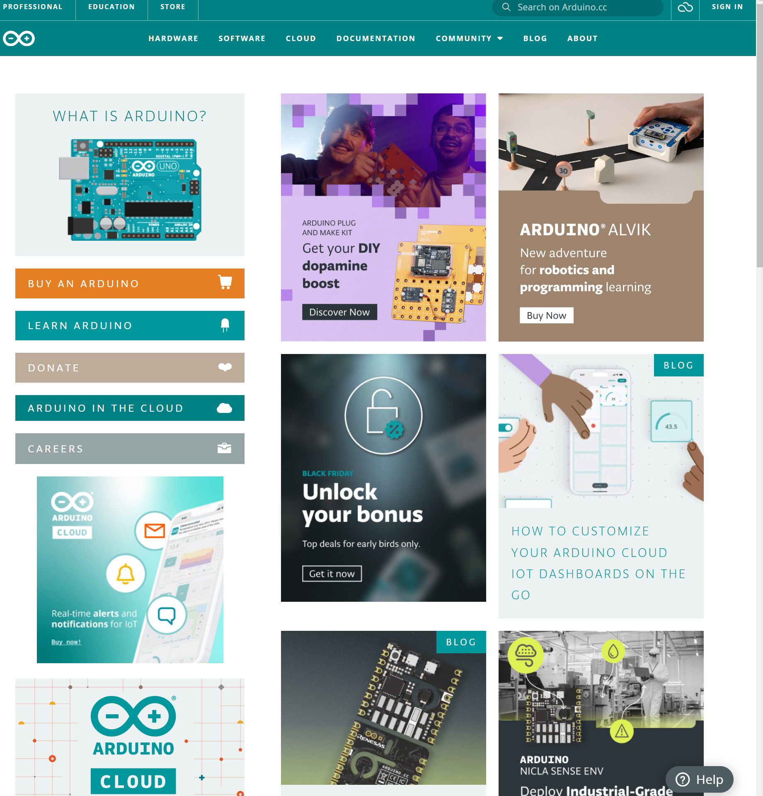

## Structure

### Pages

1. **Home Page**: Welcomes users to Arduino Lab, showcases the latest microcontroller collection, and includes a prominent call-to-action button ("Shop Now") for easy navigation.
   
2. **Product Categories**:
   - **All Items**: Lists all products available in the store. 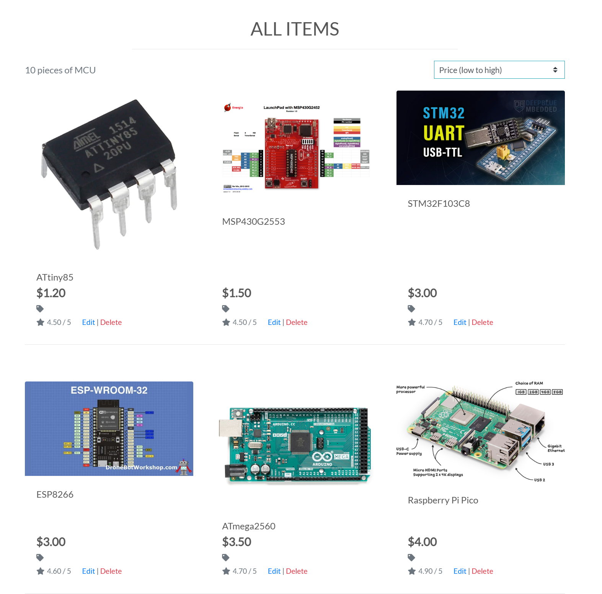
   - **AVR, ARM, ESP, Raspberry Pi, MSP430, 8051**: Individual pages dedicated to each microcontroller type. 
   - **Special Offers**: Highlights any active promotions or discounts.
3. **Search**: A search bar at the top allows users to find specific products quickly. 
4. **Cart & Checkout**: Provides a seamless shopping and payment process. 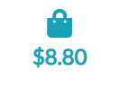
5. **Account Management**:
   - **My Account**: User login, profile management, and order history.

### Pages Provided by Django

1. **Login/Logout**: Allows users to sign in or out of their accounts.  
   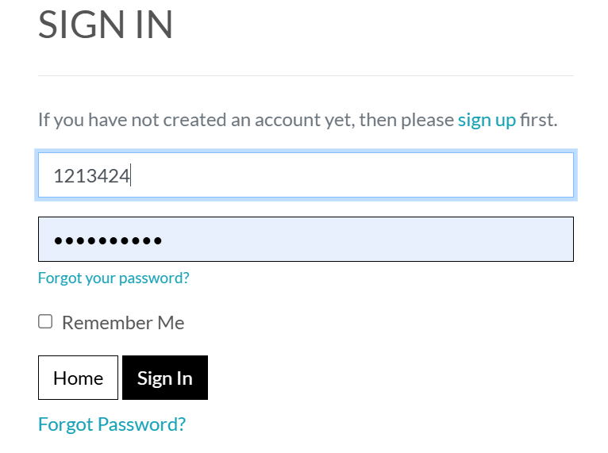 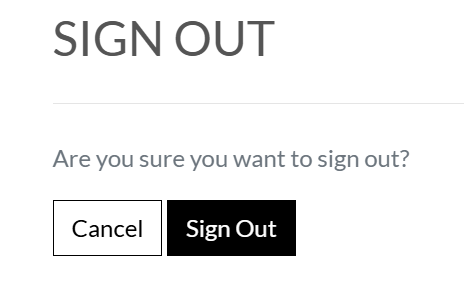
2. **User Registration**: Page for new users to create accounts. 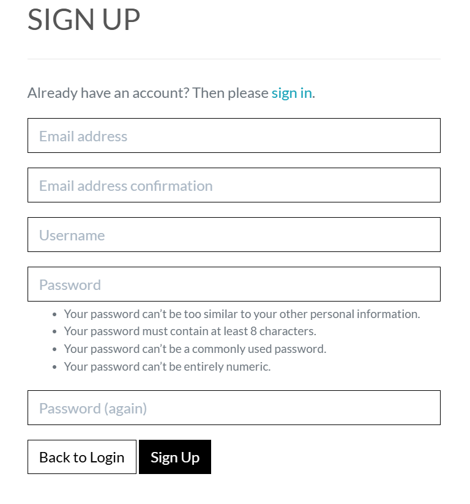
3. **Password Reset**: Helps users recover their accounts if they forget their passwords.
4. **Admin Panel**: Django's default admin panel for managing products, orders, and users. 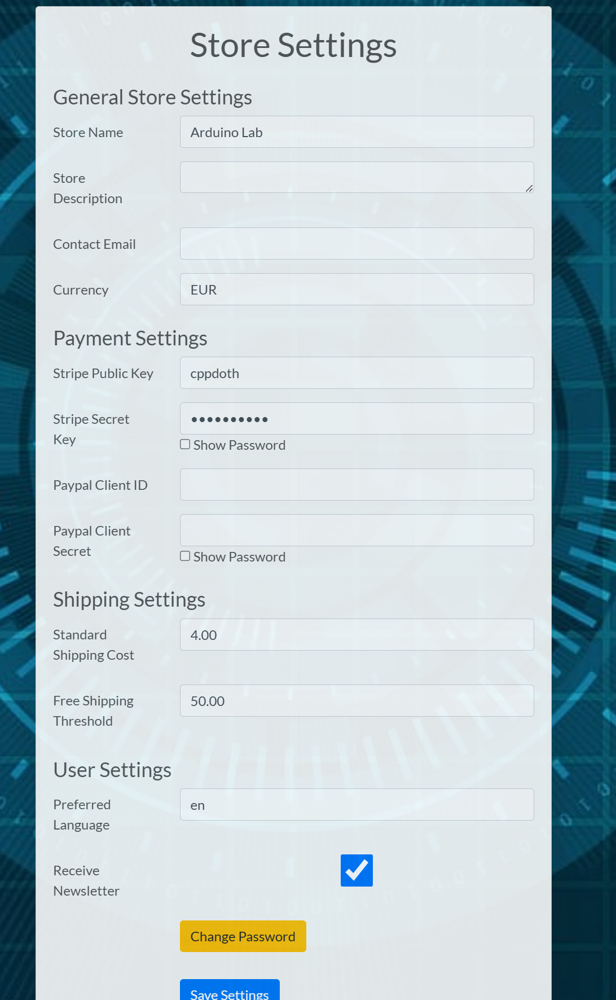

## Technical Design

### Code Structure

The **Arduino Lab** project is organized following Django's standard Django follows an MTV (Model-Template-View) structure, allowing for a clear separation of responsibilities. This structure helps with scalability, maintainability, and collaboration across different parts of the project.

#### Code Structure

The codebase for **Arduino Lab** is divided into modular Django apps, following Django’s best practices to separate functionality across the different areas of the project.

- **Home** - Provides the basic functionality for the homepage, displaying the welcome message, featured products, and navigation options.
- **Products** - Manages all functionality related to the products, including listing, filtering by category, and product details. This app supports various microcontrollers like ESP, STM, AVR, ARM, and Raspberry Pi.

- **Cart** - Implements shopping cart functionality, allowing users to add products, update quantities, and view their cart before proceeding to checkout.

- **Checkout** - Handles the checkout process, including order summary, payment processing, and order confirmation.

- **Profiles** - Manages user profiles, order history, and personal details for logged-in users. This feature is branded as "My Arduino Lab."

- **User Account** - Allows users to manage their accounts, including account deletion and authentication functionalities provided by Django allauth.

**Other Directories and Files**

- **static/** - Contains CSS, JavaScript, and other static assets used across the project.
- **media/** - Stores images for the development environment. In production, images are hosted separately on a cloud storage provider.

- **arduino_lab/** - Main Django project folder containing project settings, URLs, and configuration files for the entire project.

- **templates/** - Contains the base HTML templates, as well as templates specifically designed for Django allauth authentication (login, signup, etc.).

- **manage.py** - The primary Django command-line utility for executing administrative tasks, such as running the server, database migrations, and other commands.

- **README.md** - This file provides documentation for the project, including setup instructions, features, and usage information.

- **custom_storages.py** - Manages storage configurations for media and static files on a cloud provider, such as AWS S3, in the production environment.

- **Procfile** - Defines commands for deploying the app to Heroku, specifying how to start the web server.

- **requirements.txt** - Lists all dependencies and libraries required for the project, allowing for easy installation with `pip`.

- **robots.txt** and **sitemap.xml** - Configured for search engine optimization to help search engines index the site efficiently.

Environment variables such as API keys and database credentials are securely managed in the backend for both the development environment and the Heroku App settings. This ensures that sensitive information is protected and only accessible by authorized systems.

### Database

This project uses a PostgreSQL database hosted by Code Institute, designed to support full-featured e-commerce functionality. The database configuration provided by Code Institute simplifies the setup, allowing me to focus on developing and implementing features rather than database infrastructure.

#### Data Models

1. **Category**

   - Represents different categories of microcontrollers (e.g., AVR, ESP, ARM).
   - **Fields**:
     - `name`: The name of the category.
     - `description`: A brief description of the category.
     - `slug`: A URL-friendly identifier for the category.

2. **Product**

   - Represents an individual microcontroller or accessory available in the shop.
   - **Fields**:
     - `name`: The name of the product.
     - `description`: A detailed description of the product.
     - `price`: The price of the product.
     - `category`: A foreign key linking to the `Category` model.
     - `stock`: Number of units available.
     - `image`: Image of the product for display in the store.
     - `created_at`: Date when the product was added to the inventory.
     - `updated_at`: Date when the product details were last updated.

3. **User Profile**

   - Stores additional user information linked to Django’s default `User` model.
   - **Fields**:
     - `user`: One-to-one relationship with Django’s `User` model.
     - `address`: User’s primary address.
     - `city`: User’s city.
     - `postal_code`: Postal code for the user’s address.
     - `phone_number`: Contact number for the user.

4. **Cart**

   - Represents a shopping cart for a user session, storing items before checkout.
   - **Fields**:
     - `user`: A foreign key linking to the `User` model (optional, can also support guest checkout).
     - `created_at`: Date and time when the cart was created.
     - `updated_at`: Date and time when the cart was last updated.

5. **CartItem**

   - Represents individual items within a cart, linked to both `Cart` and `Product`.
   - **Fields**:
     - `cart`: A foreign key linking to the `Cart` model.
     - `product`: A foreign key linking to the `Product` model.
     - `quantity`: Number of units of the product in the cart.
     - `price`: Price of the item at the time of adding to the cart (for snapshotting).

6. **Order**

   - Represents a finalized purchase made by the user.
   - **Fields**:
     - `user`: A foreign key linking to the `User` model.
     - `total_price`: Total amount for the order, calculated from `OrderItem` entries.
     - `status`: Status of the order (e.g., pending, processing, completed).
     - `created_at`: Date and time when the order was placed.
     - `updated_at`: Date and time when the order status was last updated.

7. **OrderItem**

   - Represents individual items in an order, linked to both `Order` and `Product`.
   - **Fields**:
     - `order`: A foreign key linking to the `Order` model.
     - `product`: A foreign key linking to the `Product` model.
     - `quantity`: Number of units of the product in the order.
     - `price`: Price of the item at the time of purchase.

8. **Payment**
   - Manages payment information for an order, storing details from the payment gateway.
   - **Fields**:
     - `order`: A foreign key linking to the `Order` model.
     - `amount`: Total amount paid.
     - `status`: Status of the payment (e.g., successful, failed).
     - `payment_date`: Date and time of payment.

#### Schema of Models

The schema for the **Arduino Lab** project is designed to follow best practices for e-commerce applications:

- **User Profile** ↔ **User** (1-to-1)
- **Category** ↔ **Product** (1-to-Many)
- **Product** ↔ **CartItem** (Many-to-Many through Cart, with quantity tracking)
- **Cart** ↔ **User** (1-to-1 or Many-to-1, supports guest sessions)
- **Order** ↔ **User** (Many-to-1)
- **OrderItem** ↔ **Order** (Many-to-1)
- **Payment** ↔ **Order** (1-to-1)

This relational setup allows flexible operations for managing products, tracking user carts, processing orders, and handling payments. It is tailored to suit the functionality required for a microcontroller-focused e-commerce platform.

## Scope - Epics and User Stories

### Agile Workflow

To organize and manage the development process of the **Arduino Lab** project, I created two Agile boards, each representing a set of user stories that focus on distinct aspects of the project. This method enabled an efficient workflow, allowing me to structure the project setup and feature implementation in a systematic and visual manner.

#### Project Setup Board

The first board is dedicated to the setup phase of the project, covering foundational configurations and initial setup tasks. This board is a collection of tasks that establish the project environment, necessary installations, and settings, forming the groundwork for further development.

- #### Epic 1: Django Project Initialization:

  As a developer, I want to initialize a new Django project so that I can build the e-commerce platform.

- #### Epic 2: Install Required Packages:
  As a developer, I want to install essential packages like Django REST framework, Pillow, and PostgreSQL support so that I can develop key features of the e-commerce site.
- #### Epic 3: Setup Admin Panel for Store Management:
  As a developer, I want to configure the Django admin panel to manage products, categories, and orders so that the store owner can manage the shop from the backend.
- #### Epic 4: User Authentication Setup:
  As a developer, I want to set up user authentication (registration, login, logout) so that customers can create and manage accounts on the site.
- #### Epic 5: E-commerce App Creation:
  As a developer, I want to create a Django app for handling the store’s products, categories, and orders so that the e-commerce functionalities are organized.
- #### Epic 6: Database Configuration:
  As a developer, I want to configure a PostgreSQL database for the project so that data can be stored securely.
- #### Epic 7: Static and Media Files Configuration:
  As a developer, I want to configure static and media file settings so that product images and other media can be uploaded and displayed.

Each task in this board represents a key step in preparing the environment, ensuring the project is ready for feature implementation and deployment.

#### Project Implementation Board

The second board focuses on the core features and functionalities required for **Arduino Lab**. This board represents the essential components that enhance the user experience and meet the requirements of a functional e-commerce platform for microcontrollers. It encompasses various user stories, from basic shopping cart functionality to product reviews, enabling a streamlined development process.

- #### Epic 1:Product Search and Browsing:
  As a user, I want to browse and search for products like microcontrollers (ESP, AVR, STM32, Raspberry Pi) so I can find what I need easily.
- #### Epic 2:Detailed Product Information:
  As a user, I want to see detailed product information for each electronic component so that I can make informed purchasing decisions.
- #### Epic 3:Shopping Cart:
  As a user, I want to add multiple products to my shopping cart so that I can purchase them in a single transaction.
- #### Epic 4:Account Creation:
  As a user, I want to be able to create an account so that I can save my shipping details and access my order history.
- #### Epic 5:Secure Payment:
  As a user, I want to securely pay for my order using common payment methods like credit card or PayPal.
- #### Epic 6:Order Confirmation:
  As a user, I want to receive a confirmation of my order after purchase so I can be sure the transaction was successful.
- #### Epic 7:Product Filtering:
  As a user, I want to filter products by category (e.g., microcontrollers, sensors, hobby kits) so that I can narrow down my search results.
- #### Epic 8:Product Reviews:
  As a user, I want to be able to leave a review on the products I’ve purchased to share my feedback with other users.
- #### Epic 9:Create a Comprehensive README File:
  As a developer, I want to create a detailed README file so that other developers can understand how to set up and contribute to the project.
- #### Epic 10:Deployment to Heroku:
  As a developer, I want to deploy the Django project to Heroku so that the e-commerce site is accessible online.

This board represents a progressive approach to adding value to the project by implementing features that improve usability and support a comprehensive shopping experience for users. Using labels like **Must Be**, **Should Be**, and **Could Be** in the Agile workflow allowed me to maintain focus on core project requirements while also planning for additional functionalities that improve the user experience. By organizing tasks in this way, I ensured that critical setup and feature tasks were completed systematically and prioritized appropriately, supporting a clear and effective development path for **Arduino Lab**.

This Agile workflow allowed me to manage tasks efficiently, keeping track of progress and completing each step in an organized manner. Each user story reflects a specific component or functionality critical to the overall success of the **Arduino Lab** project. By dividing the work into these two boards, I maintained clarity between the setup tasks and feature development, ensuring that the project goals were achieved systematically.

# Entity-Relationship Diagram (ERD)

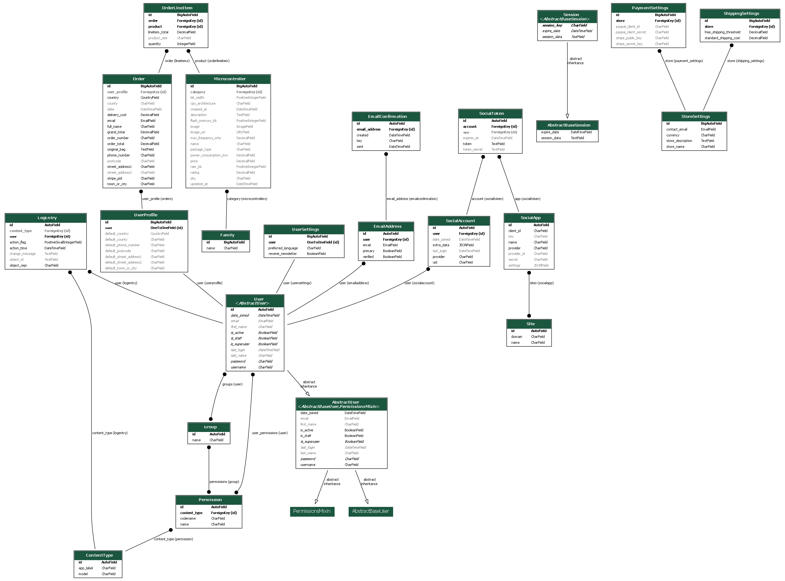

This diagram visually represents the relationships between entities in the database schema. Use it as a reference to understand the structure of your Django application.

#### Colors

The color scheme for **Arduino Lab** has been carefully chosen to create a clean, professional, and technology-oriented aesthetic. Here are the primary colors used across the site:

- **Primary Blue (#0096D6)**: Used for headers, buttons, and links, this shade of blue reflects trustworthiness and aligns well with the tech-focused theme of Arduino and microcontrollers.
- **Dark Blue (#003366)**: Employed for backgrounds and darker text areas to add depth and contrast, especially in sections like banners or hero sections.
- **White (#FFFFFF)**: Used for the primary background and text color, maintaining a clean and readable design.
- **Black (#000000)**: For text in specific areas, especially for critical calls-to-action like "Shop Now," ensuring readability and focus.

These colors provide a modern and high-tech feel, encouraging users to explore and interact with the site.

#### Design Choices

The design of **Arduino Lab** is structured to provide users with a seamless and intuitive shopping experience. Here are some of the main design elements:

- **Minimalistic and Clean Layout**: The design avoids unnecessary clutter, allowing users to focus on the primary content and products offered. This clean layout makes it easy for customers to find the information they need without distraction.
- **Large, Engaging Hero Section**: The hero section immediately greets users with a bold welcome message and a clear call-to-action button ("Shop Now"), inviting users to explore the product catalog.
- **Responsive Design**: The layout is optimized for different screen sizes, ensuring a consistent experience across devices, whether on a desktop, tablet, or mobile.
- **Highlighted Offers and Categories**: Key information like free delivery promotions and major product categories are prominently displayed, guiding users effortlessly through the site.

These design choices aim to balance aesthetics with functionality, creating a site that is both visually appealing and easy to navigate.

#### Typography

The typography chosen for **Arduino Lab** is straightforward and professional, aligning with the clean and tech-focused brand image.

- **Primary Font**: A sans-serif font like _Roboto_ or _Open Sans_ has been used for its clarity and readability, particularly on digital screens. This typeface contributes to a modern and tech-savvy look.
- **Font Sizes**:
  - **Headers**: Larger font sizes are used for headers, such as the main welcome text, to draw attention and create a visual hierarchy.
  - **Body Text**: Regular-sized fonts are used for descriptions, product details, and other information-heavy sections to ensure easy readability.
  - **Buttons and Links**: Bold and slightly larger fonts are used for calls-to-action like "Shop Now" to emphasize clickable elements.

This typography enhances the overall readability of the site, ensuring that information is accessible and visually balanced.

## Existing Features

### Feature 1: The Navbar

- **Purpose**: Provides users with easy access to all parts of the website.
- **Features**:
- **Categories Links**: Includes quick links to product categories such as AVR, ARM, ESP, Raspberry Pi, MSP430, and more, making it easy for users to find the specific type of microcontroller they're looking for.
  
- **Search Bar**: Positioned at the top of the page, enabling users to quickly search for products by keywords.
- **Account and Cart Icons**: Accessible icons for user account management and shopping cart overview. The cart icon displays the current item count, helping users keep track of their purchases as they browse.
  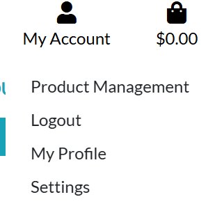

This is how Navigation bar looks on mobile device:

- **Mobile navigation bar** 

### Feature 2: The Home Page

- **Purpose**: Acts as the main entry point for the site, showcasing featured content and promotions.
- **Features**:
- **Hero Banner**: A visually engaging banner that welcomes users to Arduino Lab, with a message encouraging creativity with the latest microcontrollers.
  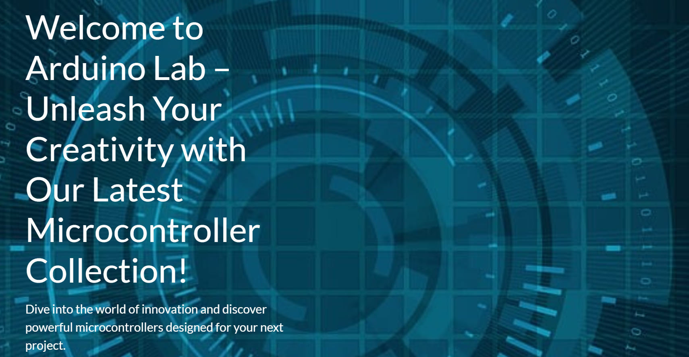
- **Shop Now Button**: A call-to-action button in the hero banner that directs users to the product listings, inviting them to start browsing immediately.
  
- **Promotional Banner**: Highlights promotions such as "Free delivery on orders over $50," to encourage larger purchases.
  
- **Social Media and Newsletter Section**: A section at the top that allows users to subscribe to the newsletter for exclusive deals.
  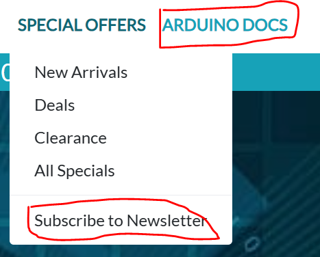

This is how Home Page looks on mobile device:

- **Mobile Home Page** 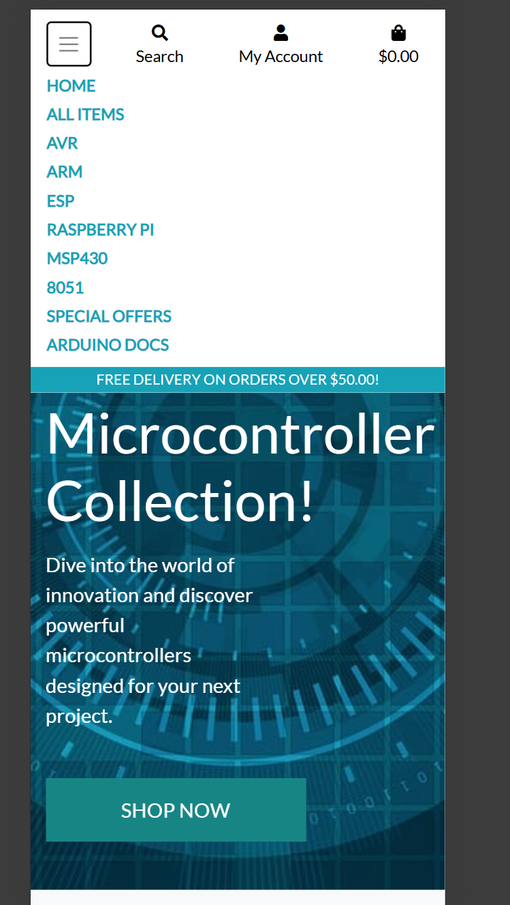

### Feature 3: The Footer

- **Purpose**: Provides additional navigational links and engagement options at the bottom of page.
- **Features**:

  - **Social Media Link**: Links to Arduino Lab’s Facebook page, offering users a way to stay connected and informed about updates.
    
  - **Newsletter Signup**: An email signup form where users can subscribe to monthly updates, receiving exclusive offers and product news.
    

  This is how Footer looks on mobile device:

- **Mobile Footer** 

### Feature 4: The Products List

- **Purpose**: Displays a comprehensive list of all available products for easy browsing and selection.
- **Features**:

  - **Product Categories**: Filters that allow users to select and browse specific types of microcontrollers, narrowing down their options. 
  - **Product Filtering and Sorting**: Users can sort products based on criteria like price(low to high or opposit),rating(low to high and apposit),category(A-Z and Z-A) and name(A-Z and Z-A). 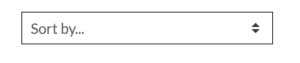

    This is how the product list looks on mobile device:

- **Mobile Product List** 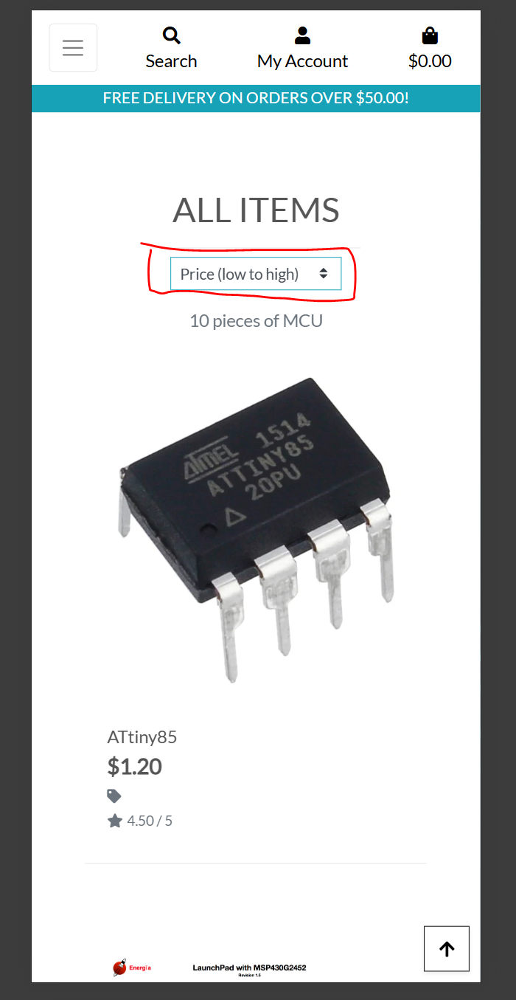

### Feature 5: The Product Detail Page

- **Purpose**: Provides in-depth information about each product, enabling users to make informed purchase decisions.
- **Features**:

  - **Product Image and Description**: High-quality images along with a detailed description that outlines the product's features, specifications, rating,price and quantity.
  - **Pricing and Quantity**: Clearly visible pricing information and quantity of product to inform users. ![]
  - **Add to Cart Button**: Enables users to directly add the product to their cart with a single click, making the shopping process efficient. 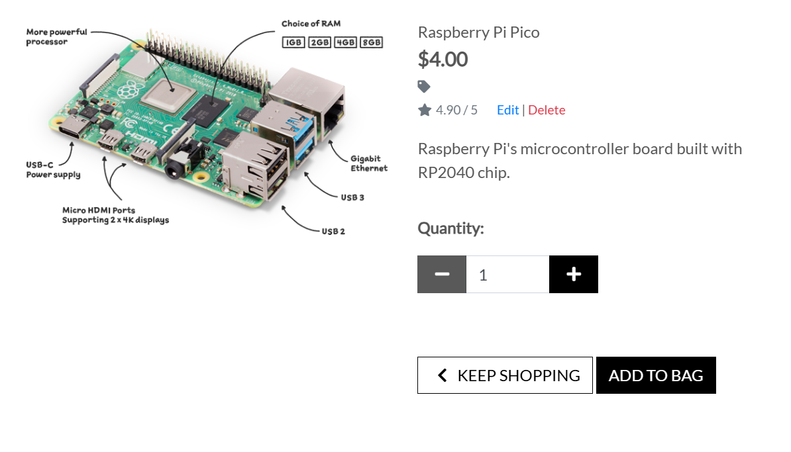

    This is how the product detail page looks on mobile device:

- **Mobile Product detail page** 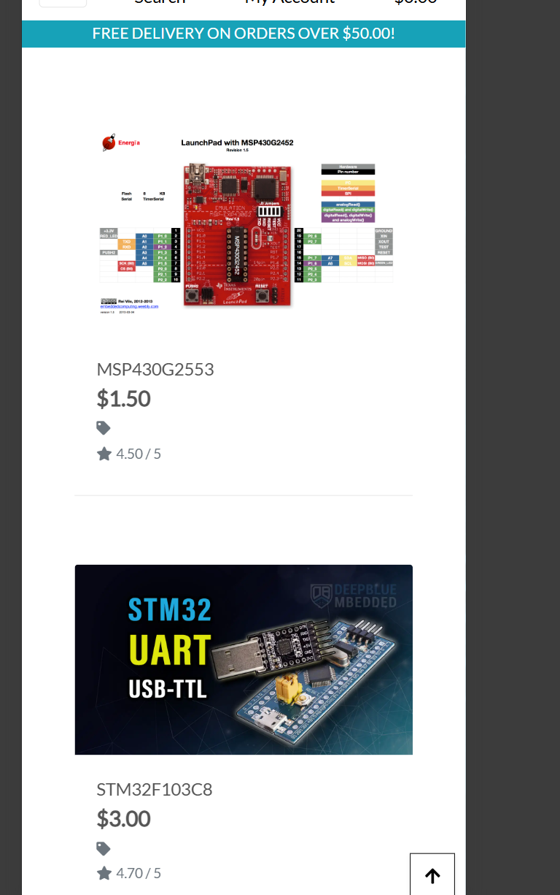

### Feature 6: The Cart

- **Purpose**: Allows users to review their selected items and make any adjustments before proceeding to checkout.
- **Features**:

  - **Cart Summary**: Shows all items added to the cart, including details like item name, quantity, and individual price. Users can also see the subtotal for each item and the total cost for all items in the cart.
  - **Update and Remove Options**: Users can easily adjust quantities or remove items if they change their mind.
  - **Proceed to Checkout**: A prominent button that directs users to the checkout page, where they can complete their purchase. 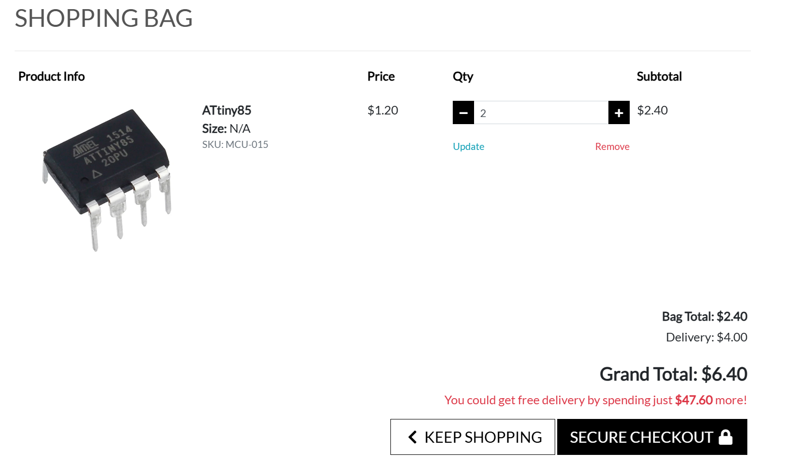

    This is how Cart page looks on mobile device:

- **Mobile Cart** 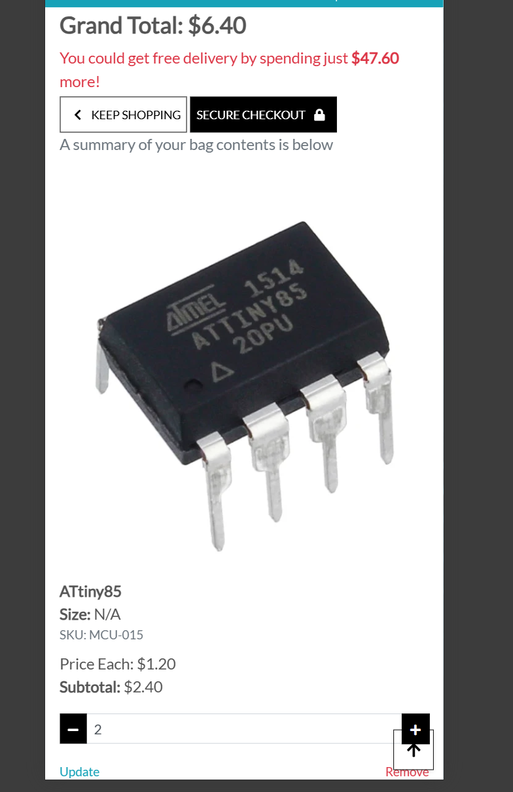

### Feature 7: The Sign Up/In/Out Pages

- **Purpose**: Allows users to create and manage their accounts, providing a more personalized shopping experience.
- **Features**:

  - **Sign Up Form**: New users can create an account by providing their name, email, and password, which enables them to save their information for future use. 
  - **Sign In**: Existing users can log in to their accounts to access their saved information and view their order history.
  - 
  - **Sign Out**: Securely logs users out of their accounts, ensuring privacy and data security.
  - 

    This is how Sign Up/In/Out Pages looks on mobile device:

- **Sign Up/In/Out Pages**
- 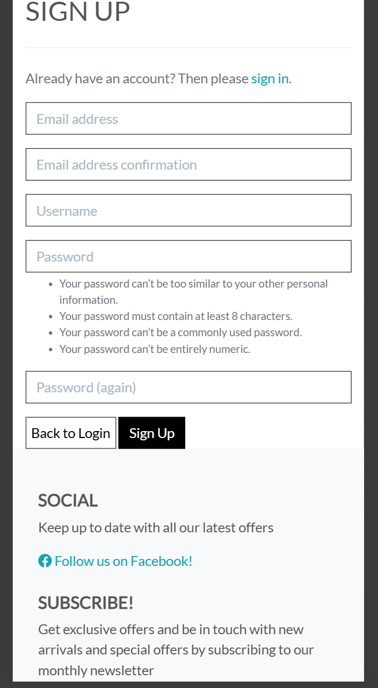,
- 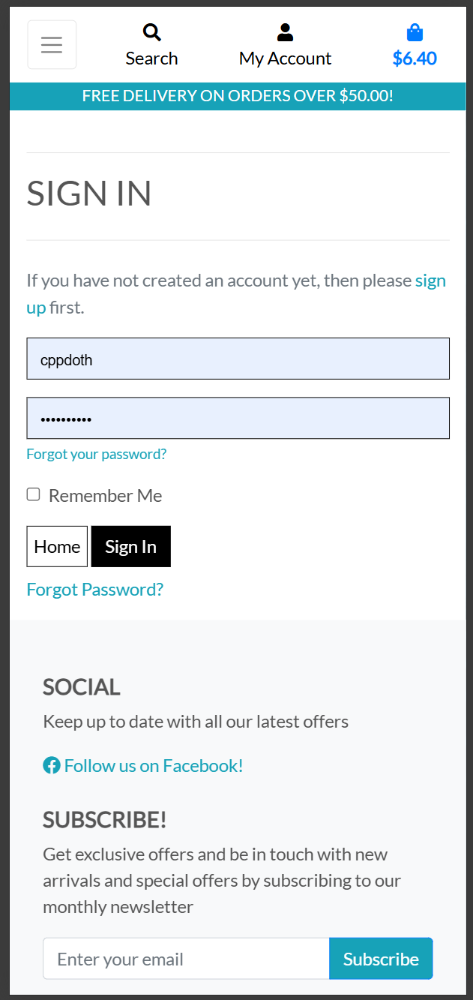,
- 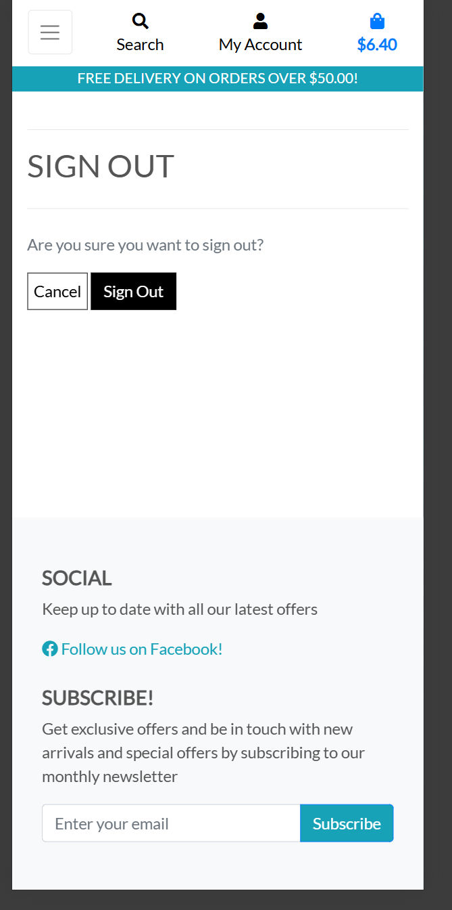.

### Feature 8: The Product management

The **Product Management** feature in **Arduino Lab** enables administrators to effectively manage and organize the catalog of microcontrollers and related products. This feature allows for streamlined inventory management and provides a straightforward interface to input all relevant technical specifications for each product.

#### Key Functionalities:

- **Add a New Product**:

  - Administrators can easily add new microcontrollers or other products using a comprehensive form.
  - The form includes fields for detailed specifications, ensuring that customers have complete and accurate information about each product.

- **Product Fields**:

  - **SKU**: A unique identifier for each product.
  - **Name**: The official name of the microcontroller or component.
  - **Category**: Selection from various categories (e.g., AVR, ARM, ESP), helping to organize products into searchable groups.
  - **Bit Width**: Specification of the bit width, such as 8-bit, 16-bit, or 32-bit.
  - **CPU Architecture**: Options to specify the CPU architecture (e.g., ARM Cortex, RISC-V).
  - **Max Frequency (MHz)**: The maximum operating frequency of the microcontroller, entered in MHz.
  - **RAM Capacity (KB)**: The amount of RAM available in the microcontroller, measured in KB.
  - **Flash Memory (KB)**: The storage capacity of the flash memory, also in KB.
  - **Power Consumption (mW)**: Expected power consumption, listed in milliwatts.
  - **Package Type**: Physical form factor of the microcontroller, allowing users to select from common types.
  - **Description**: A text field for additional details about the product, such as features, use cases, and compatibility.

- **Editing Existing Products**:

  - Products can be modified with updated information, such as changes to specifications, new images, or revised prices. This is essential for keeping product data accurate and relevant.

- **Removing Products**:
  - Outdated or unavailable products can be removed from the catalog, ensuring the store remains current and customers don’t encounter products that cannot be purchased.

#### Benefits:

- **Enhanced User Experience**: Customers have access to detailed product information, making it easier to make informed purchase decisions.
- **Efficient Inventory Management**: Administrators can efficiently update product data, ensuring the online store reflects real-time stock levels and accurate specifications.
- **Better Organization**: With categories and detailed fields, customers can filter and search products based on technical specifications, streamlining the browsing experience.

The **Product Management** feature is essential for maintaining an up-to-date and organized product catalog on the Arduino Lab platform, supporting both administrative efficiency and customer satisfaction.
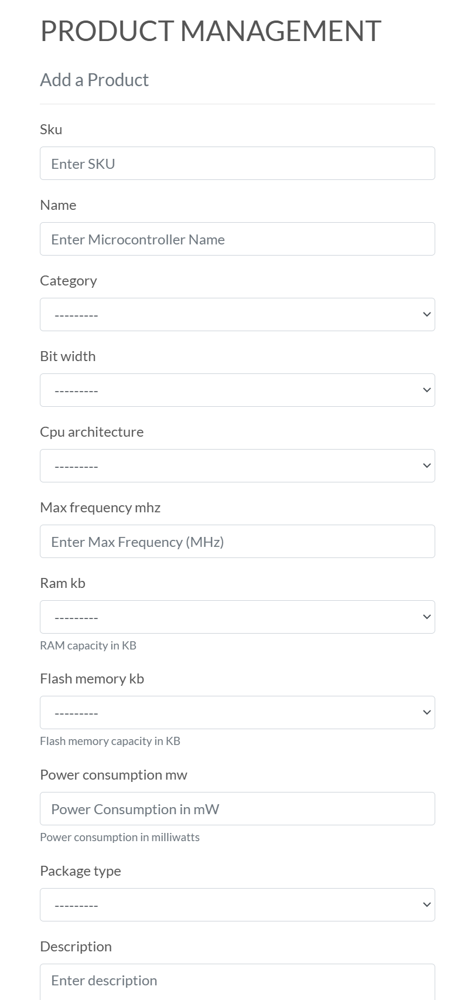

### Feature 9: Store Settings

The **Store Settings** feature in **Arduino Lab** provides administrators with a comprehensive panel to manage various configurations for the online shop. This feature allows for the customization of store information, payment options, shipping policies, and user preferences, enabling efficient and flexible control over the store’s operation.

#### Key Functionalities:

- **General Store Settings**:

  - **Store Name**: Set the name of the store, displayed to users.
  - **Store Description**: Add a brief description to inform customers about the store’s purpose or mission.
  - **Contact Email**: Input a contact email address, allowing customers to reach out for support or inquiries.
  - **Currency**: Define the currency (e.g., EUR, USD) used for product pricing, helping internationalize the store.

- **Payment Settings**:

  - **Stripe Public Key**: Enter the public API key for Stripe, enabling integration with Stripe for secure payment processing.
  - **Stripe Secret Key**: Configure the secret API key for Stripe. This key is securely handled and can be shown/hidden for convenience.
  - **PayPal Client ID**: Add the Client ID for PayPal, another widely-used payment gateway, allowing users to check out with PayPal.
  - **PayPal Client Secret**: Input the secret key for PayPal transactions, with the option to show or hide for security purposes.

- **Shipping Settings**:

  - **Standard Shipping Cost**: Set a default shipping cost applied to orders under a certain amount, helping cover shipping expenses.
  - **Free Shipping Threshold**: Define the minimum order amount required for free shipping, encouraging higher order values.

- **User Settings**:

  - **Preferred Language**: Specify the default language for the store’s interface, improving accessibility for users from different linguistic backgrounds.
  - **Receive Newsletter**: A toggle for receiving newsletters, allowing administrators to control subscription preferences for promotional emails.

- **Account Management**:
  - **Change Password**: Provides a link to update the store admin’s password, ensuring security.
  - **Save Settings**: A button to save all changes, ensuring that the latest settings are applied immediately.

#### Benefits:

- **Centralized Configuration**: Allows administrators to manage key store settings in one place, improving efficiency and reducing configuration errors.
- **Customizable User Experience**: The ability to set language preferences and other user options enhances the shopping experience for a global audience.
- **Flexible Payment and Shipping Options**: Enables a range of payment options and shipping policies, accommodating various user preferences and boosting customer satisfaction.
- **Enhanced Security**: By securely handling sensitive information like API keys and passwords, this feature helps maintain data protection standards.

The **Store Settings** feature is essential for administrators to configure and customize store operations in Arduino Lab, ensuring a tailored and streamlined shopping experience for users.


### Feature 10: Change Password

The **Change Password** feature in **Arduino Lab** allows users to update their account password securely and efficiently. This feature enhances account security by enabling users to set a new password as needed, while also providing options to ensure visibility during the process for convenience.

#### Key Functionalities:

- **Old Password**: Users are required to enter their current password to confirm their identity before making any changes.
- **New Password**: Allows users to input a new password, which must meet certain security criteria to be accepted.
- **Confirm New Password**: Users are prompted to re-enter their new password to prevent errors and ensure accuracy.

- **Show Password Toggle**: For each password field (Old Password, New Password, and Confirm New Password), there is a "Show Password" checkbox. This feature allows users to view the entered password to minimize typing errors.

- **Save Settings**: Once the user has entered and confirmed the new password, clicking **Save Settings** will update the password securely.
- **Cancel**: Users can cancel the password change process, returning to the previous page without saving any changes.

#### Benefits:

- **Enhanced Security**: This feature strengthens user account security by allowing password updates at any time.
- **User-Friendly**: The **Show Password** option allows users to confirm their input visually, reducing mistakes.
- **Error Prevention**: The "Confirm New Password" field ensures that users enter their desired password correctly without typos.

The **Change Password** feature is essential for maintaining account security on Arduino Lab, empowering users to manage their passwords easily and confidently.

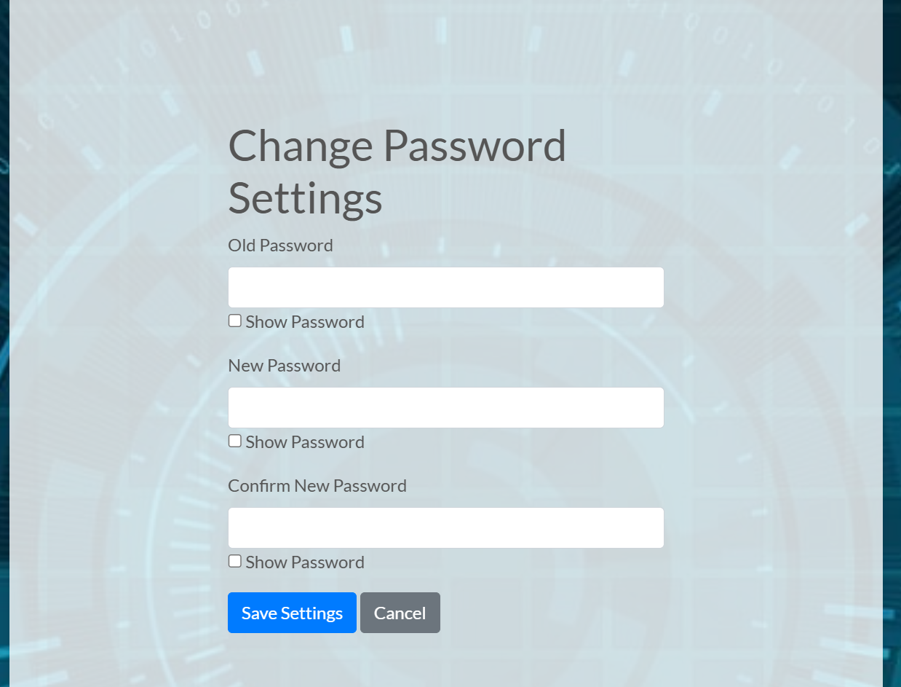

### Feature 11 : My Profile

The **My Profile** section in **Arduino Lab** allows users to manage their personal information and view past orders in a streamlined and user-friendly interface. This feature provides users with control over their account settings and helps them track their purchase history.

#### Key Functionalities:

- **Default Delivery Information**: Users can update their default delivery details, including fields for address, city, state, and country. This ensures a smooth and personalized checkout experience by pre-filling the shipping information on future orders.

- **Order History**: Users can view a list of their previous orders, with details including:

  - **Order Number**: A unique identifier for each order, with clickable links to view the complete order details.
  - **Date**: The date and time of the purchase, allowing users to keep track of their shopping history.
  - **Items**: A summary of the purchased items, displaying the product name and quantity.
  - **Order Total**: The total amount spent on each order, providing a quick reference for financial tracking.

- **Update Information Button**: Once users have edited their delivery details, they can click the **Update Information** button to save the changes securely to their profile.

#### Benefits:

- **Convenient Account Management**: Users can quickly update their delivery information to ensure accurate shipping for future orders.
- **Order Tracking**: The order history provides a clear and organized view of past purchases, allowing users to review previous transactions at a glance.
- **Streamlined Checkout**: By storing default delivery information, the profile section simplifies the checkout process, making future purchases faster and more efficient.

The **My Profile** feature is designed to enhance the user experience on Arduino Lab by giving users full control over their account settings and purchase records.
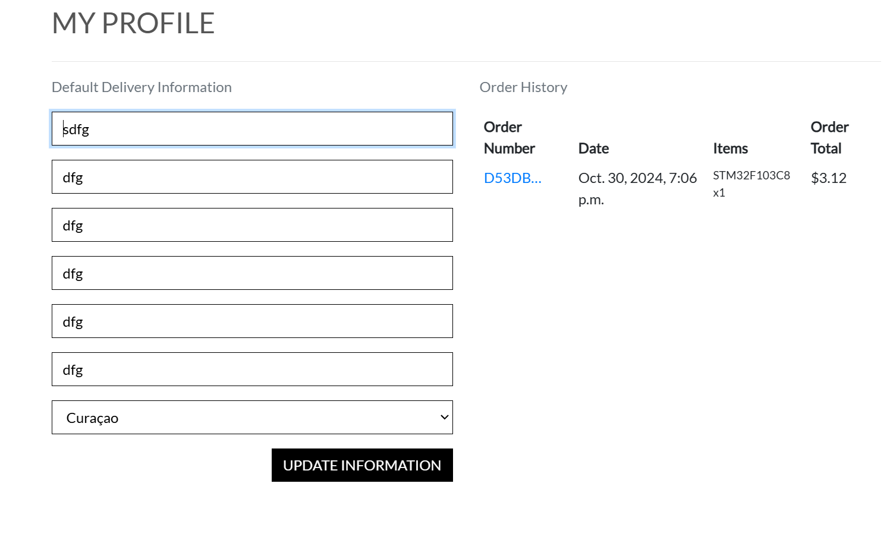

## Features Yet to Implement

As an enthusiast and passionate developer in the world of Arduino and microcontrollers, I am excited to enhance this project continuously. My goal is to implement these additional features to make **Arduino Lab** a fully functional and robust e-commerce platform for microcontroller enthusiasts and, ultimately, to launch it as a real online shop. Here are some of the future enhancements I plan to add:

- **Advanced Product Search and Filtering**  
  Implement filters for specifications such as CPU architecture, RAM size, and power consumption to allow users to easily find microcontrollers that meet specific technical requirements.

- **Customer Reviews and Ratings**  
  Allow users to leave reviews and rate products. This feature will help other customers make informed purchasing decisions and improve overall engagement with the site.

- **Wishlist Functionality**  
  Enable users to save products they are interested in to a wishlist. This feature would let users easily access saved items later, enhancing the shopping experience.

- **Inventory Management System**  
  Integrate a backend inventory management system that tracks stock levels, alerts administrators when items are low in stock, and automatically adjusts availability on the front end.

- **Product Comparison Tool**  
  Allow customers to compare specifications across different microcontrollers side by side, helping them choose the best product for their project requirements.

- **Discounts and Promo Codes**  
  Implement a system for discount codes and promotions. Admins could create limited-time offers or bulk discounts, encouraging more purchases and allowing for seasonal campaigns.

- **Enhanced User Profiles**  
  Expand user profile options to include saved shipping addresses, order tracking, and notifications about new products or restocks on items they've previously viewed.

- **Detailed Order Tracking**  
  Provide users with a tracking feature that shows the status of their orders at each stage—from processing and shipping to delivery.

- **Frequently Bought Together Suggestions**  
  Add a feature to suggest additional items based on what other customers frequently purchase together, such as complementary modules or components.

- **Automated Restock Notifications**  
  Allow users to sign up for notifications on out-of-stock items. They would receive an email or in-app notification when a product is available again.

- **Live Chat Support**  
  Integrate a live chat feature to provide real-time support, helping users with product questions, purchase decisions, or any technical inquiries they may have.

- **Product Video Tutorials**  
  Add tutorial videos for each microcontroller, showcasing setup guides, usage examples, and project ideas to provide additional value to users and inspire creativity.

These features represent my vision for **Arduino Lab** as a comprehensive platform that supports both hobbyists and professionals in the Arduino community. With these planned features, I am excited about the potential for **Arduino Lab** to become a go-to resource for anyone interested in microcontrollers.

## Technologies Used

### Languages

- [Python 3.10.3](https://www.python.org/) - Used for backend programming and to build the main application logic.
- [HTML5](https://en.wikipedia.org/wiki/HTML5) - Used for structuring all web pages on the front end.
- [CSS3](https://en.wikipedia.org/wiki/CSS) - Utilized for styling the website to create a clean and responsive user interface.
- [JavaScript](https://en.wikipedia.org/wiki/JavaScript) - Used for front-end functionality and interactive elements.

### Frameworks, Libraries, and Other Resources

The **Arduino Lab** project is built on the powerful [Django](https://www.djangoproject.com/) framework, utilizing many of its features to streamline development and enhance functionality.

- [Django](https://www.djangoproject.com/) - The core framework used to build the project, handling backend functionality, database management, and templating.
- [Bootstrap 4](https://getbootstrap.com/) - Used as a CSS framework to ensure responsive design and ease of styling.
- [jQuery](https://jquery.com/) - JavaScript library used to simplify client-side scripting and enhance interactivity.
- [Font Awesome](https://fontawesome.com/) - Used for icons throughout the site to improve visual clarity and user navigation.
- [Google Fonts](https://fonts.google.com/) - Used for custom fonts, giving the website a unique and professional look.

### External Services

- [Facebook Pages](https://www.facebook.com/pages/create/?ref_type=site_footer) - A Facebook Business Page was created for the project and linked in the footer to improve social media presence and connect with users.
- [Stripe](https://stripe.com/) - Integrated to handle secure online payments, enabling users to purchase products seamlessly.
- [AWS S3 Bucket](https://aws.amazon.com/s3/) - Used to host and serve static files (CSS, JavaScript) and media files (product images), ensuring fast and reliable file access.
- [Heroku](https://www.heroku.com) - Used to deploy the Django application, providing a stable and scalable hosting solution.

### Development and Collaboration Tools

- [VS Code](https://code.visualstudio.com/) - Used as the primary local development environment. Its robust features and extensions made coding, debugging, and testing efficient and streamlined.
- [Git](https://git-scm.com/) - A version control system used to track code changes, commit updates, and manage branches.
- [GitHub](https://github.com/) - The project repository is hosted on GitHub, allowing for version control, issue tracking, and collaboration.

These technologies and tools were carefully chosen to ensure **Arduino Lab** provides a smooth and functional experience, catering to the specific needs of users looking for microcontroller products.

### Testing

#### Overview

Testing is a critical part of the **Arduino Lab** project to ensure the functionality, reliability, and user experience of the e-commerce platform.

---

#### **Manual Testing**

1. **Navigation Testing**

   - Verified that all links in the navbar and footer navigate to the correct pages.
   - Ensured that the "Shop Now" button on the homepage redirects to the product listing page.
   - Tested the responsiveness of the navbar and footer on mobile devices.
     
     

2. **Product Search and Filtering**

   - Tested the functionality of the search bar by entering various keywords.
   - Verified that filtering options (e.g., price, rating, category) work correctly and return accurate results.
     
     

3. **Product Details**

   - Ensured that clicking on a product displays its details, including name, price, description, and stock availability.
   - Tested that the "Add to Cart" button adds the correct item to the cart.
     

4. **Shopping Cart**

   - Verified that the cart accurately reflects added items, with correct quantities and pricing.
   - Tested the "Update" and "Remove" options for items in the cart.
     

5. **Account Management**

   - Confirmed that users can register, log in, and log out without errors.
   - Tested the password reset functionality to ensure it works as expected.
     
     

6. **Checkout and Payment**
   - Simulated a checkout process and verified that the payment page handles valid and invalid inputs correctly.
   - Ensured that orders are created and stored in the database after successful payment.

### 1. **Lighthouse Testing**

#### Overview

Lighthouse was used to test the performance, accessibility, best practices, and SEO of the **Arduino Lab** application. The testing included verifying link functionality, button redirects, and mobile responsiveness.

#### Testing Steps

1. **Navbar and Footer Links**

   - Verified that all links in the navbar and footer navigate to the correct pages.
   - Ensured that the "Shop Now" button on the homepage redirects to the product listing page.
     
     

2. **Mobile Responsiveness**

   - Confirmed that the navbar and footer adapt seamlessly to various screen sizes.
   - Ensured clickable elements are accessible and visually aligned on mobile devices.

3. **Accessibility**

   - Verified that all pages have appropriate alt attributes for images, semantic HTML structure, and sufficient contrast for readability.

4. **Performance**
   - Lighthouse testing results showed:
     - **Performance**: High performance for page load times and interactivity.
     - **Accessibility**: Excellent ratings for accessibility across all pages.
     - **Best Practices**: Fully compliant with web development best practices.
     - **SEO**: Proper meta tags and structured data resulted in strong SEO scores.

---

### **PEP8 Compliance Testing**

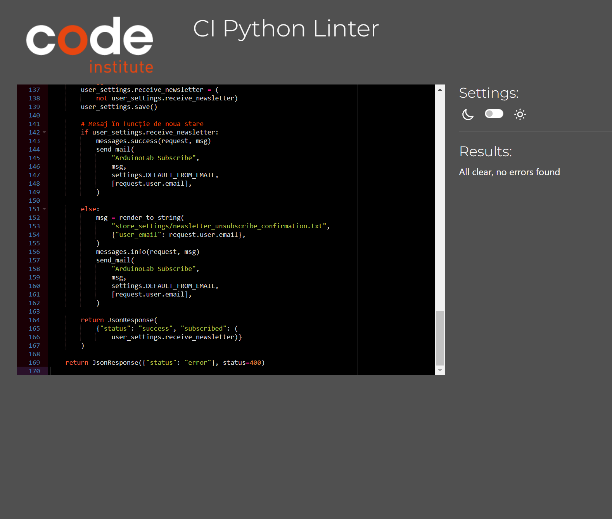
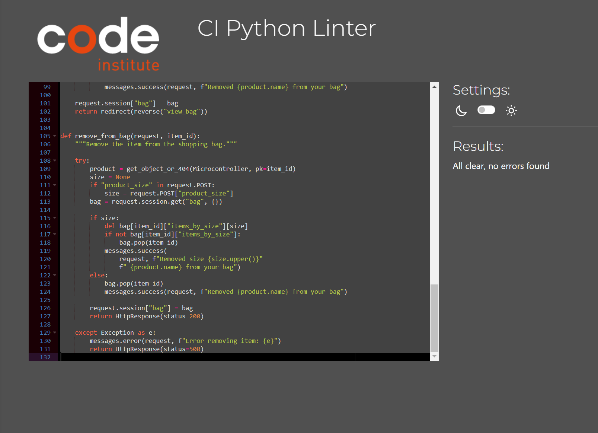

#### Overview

PEP8 compliance ensures that the Python code in **Arduino Lab** is clean, readable, and adheres to Python's style guidelines. This was verified using automated tools.

#### Testing Steps

1. **Setup**

   - Used `flake8` as the primary tool to check for PEP8 compliance.
   - Configured `.flake8` file with the following:
     ```plaintext
     [flake8]
     max-line-length = 79
     ignore = E501,W503
     ```

2. **Running Tests**

   - Executed the following command to scan the codebase for PEP8 violations:
     ```bash
     flake8 --exclude=migrations,static,media
     ```

3. **Results**
   - **Models**: No violations found. Code adheres to best practices, with properly structured classes and relationships.
   - **Views**: Minimal issues fixed (e.g., line length, spacing).
   - **Forms**: Fully compliant with no adjustments required.
   - **Settings**: Clean and modular settings files passed compliance checks.

#### Fixes Applied

- Shortened lines exceeding 79 characters.
- Removed unnecessary whitespace and added consistent indentation.
- Renamed variables for clarity and compliance with naming conventions.

#### Tools Used

- `flake8`
- `autopep8` for automatic fixes:
  ```bash
  autopep8 --in-place --aggressive --recursive .
  ```

---

#### **Bug Fixes**

- Fixed an issue where the cart would not shows the image of the added product .

#### **Screenshots of Testing**

Below are some screenshots showcasing the testing process:

- 
- 
- 
- 
- 

## Other Services

### Stripe

Stripe was used as a payment service, allowing users to pay for products. The process:

1. Create an account at https://stripe.com/
2. Go to the developers pane and navigate to API keys
3. Copy the publishable and secret keys and put them in your config vars in your development envirenment (and in Heroku config vars in production)

Webhooks were created too to make sure payments did not fail due to web errors. This can be done by doing the following:

1. Navigate to Webhooks on the page, and create an endpoint with the url you send your webhooks to, in this case, the url is https://stepup-shoes.herokuapp.com/checkout/wh/
2. Add events to listen for, for example payment_intent_succeeded and payment_intent.payment_failed as in this case
3. The webhooks should be sent when processing orders in all cases

## Deployment

### Forking the GitHub Repository

To make a clone, or 'Fork' this repository, follow the steps below.

1. Access your GitHub account and find the relevant repository.
2. Click on 'Fork' on the top right of the page.
3. You will find a copy of the repository in your own Github account.

### Making a Local Clone

1. Access your GitHub account and find the relevant repository.
2. Click the 'Code' button next to 'Add file'.
3. To clone the repository using HTTPS, under clone with HTTPS, copy the link.
4. Open Git Bash.
5. Access the directory you want the clone to be have.
6. In your IDE's terminal type 'git clone' and the paste the URL you copied.
7. Press Enter.
8. You now have a local clone.

### Heroku

This application has been deployed from Github using Heroku. Here's how:

1. Create an account at [heroku.com](https://www.heroku.com/)
2. Create a new app, add app name and your region
3. Click on create app
4. Go to "Settings"
5. Under Config Vars, add your sensitive data (creds.json for example)
6. For this project, I set buildpacks to <Python> in that order.
7. Go to "Deploy" and at "Deployment method", click on "Connect to Github"
8. Enter your repository name and click on it when it shows below
9. Choose the branch you want to buid your app from
10. If desired, click on "Enable Automatic Deploys", which keeps the app up to date with your Github repository
11. All done!

### AWS S3

The deployed version of this website has static(CSS and JavaScript) and media files hosted to it via a web based service called Amazon Web Services S3 Bucket.

The steps to take are:

1. Create an account at aws.amazon.com
2. Navigate to the IAM application and create a user and group
3. Set the AmazonS3FullAccess for the user and copy the AWS ACCESS and SECRET keys as config vars to your workspace and deployment environment
4. Create a new Bucket within the S3 application with an appropriate name.
5. Enable public access to allow users to view and download content, as outlined in AWS S3 documentation.: https://aws.amazon.com/s3/

## Credits

### Copyrights

#### Media

- Product images and site background images are sourced from publicly available platforms like:

  - [Google](https://google.com)
  - [Pixabay](https://pixabay.com)
  - These platforms provide royalty-free images under their respective licenses. For Pixabay, all images are released under the Pixabay License, allowing both personal and commercial use without attribution.

- Icons used across the site are from [Font Awesome](https://fontawesome.com), which permits free use under their license for personal and open-source projects.

#### Legal Disclaimers

1. **Educational Purpose**:

   - This project is built exclusively for educational purposes as part of the **Code Institute Full-Stack Development Course**. It is not intended for commercial use or profit generation.
   - The site does not sell actual products, and all transactions are simulated for demonstration purposes.

2. **Attribution**:

   - All third-party resources, including images, fonts, and libraries, are credited to their respective creators.
   - No claim of ownership is made over any third-party assets used in this project.

3. **Licensing**:

   - Media and assets sourced under open licenses (such as the Pixabay License) are used in accordance with their terms. No copyrighted material is used without permission or proper licensing.

4. **Trademarks**:

   - Any references to Arduino, ESP32, Raspberry Pi, or other trademarks are for educational purposes only. This project is not affiliated with or endorsed by these companies.

5. **Liability**:

   - The author of this project assumes no liability for the misuse of the content or adaptation of the code for unauthorized purposes.
   - Users of this project are responsible for ensuring compliance with all applicable laws and regulations when adapting the code for their own use.

6. **No Warranty**:
   - This project is provided "as is" without any warranty, either express or implied, including but not limited to warranties of merchantability or fitness for a particular purpose.

#### Content

- The text and descriptions used in this project, including product information, are fictional and created solely for the purpose of demonstrating functionality.
- Any resemblance to real products or services is purely coincidental.

---

### Coding Tips and Tricks

These are some tips and resources that have helped me throughout this project:

#### **Code Institute Boutique Ado Project**

The **Code Institute Boutique Ado project** served as a significant source of inspiration and guidance for this project. Many of the concepts, techniques, and best practices applied in the development of **Arduino Lab** were learned and adapted from this comprehensive e-commerce project tutorial provided by Code Institute.

#### Key Lessons Learned:

- **Django Framework**:

  - Understanding the Django MVC (Model-View-Controller) structure and applying it to build scalable, maintainable applications.
  - Utilizing Django’s built-in features like authentication, forms, and admin panel for rapid development.

- **Database Management**:

  - Learning to structure models for e-commerce, including categories, products, orders, and user profiles.
  - Implementing foreign key relationships and optimizing database queries.

- **Payment Integration**:

  - Adapting the payment workflow demonstrated in Boutique Ado to integrate **Stripe** into this project for secure and seamless checkout experiences.

- **Responsive Design**:
  - Leveraging Bootstrap and CSS techniques taught in Boutique Ado to ensure the site is user-friendly across devices.

---

#### Acknowledgment

I would like to express my sincere gratitude to the entire team at **Code Institute**, whose comprehensive curriculum, guidance, and unwavering support have been instrumental in my learning journey.

A special thank you goes to all the instructors, mentors, and contributors who have dedicated their time and effort to create such an exceptional learning environment. Your expertise and dedication have not only equipped me with the technical skills to complete this project but have also elevated my understanding and confidence in full-stack development to a level I never thought possible.

As this is my final project in the program, I am profoundly grateful for the countless opportunities provided by Code Institute to grow and succeed. Your encouragement and teaching have been a cornerstone of my development, and I am leaving this program with skills, knowledge, and a passion for software development that I will carry forward in my career.

Thank you for everything.
